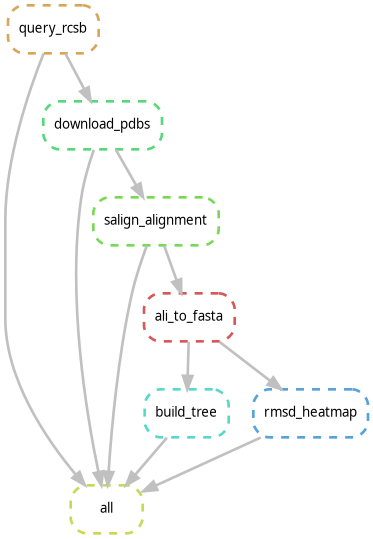

# DPS Structural Pipeline

**Automated and reproducible workflow for retrieving Dps protein structures, performing structural alignment, and constructing phylogenetic trees.**

This pipeline performs a complete structural bioinformatics workflow to analyze Dps proteins across all species in the Protein Data Bank. The workflow is managed using Snakemake and executed within containers for full reproducibility.

The pipeline automatically queries the RCSB PDB database for all Dps structures, selects the best structure per species (by resolution), performs structural alignment using MODELLER's SALIGN algorithm, and constructs a phylogenetic tree.
https://salilab.org/modeller/registration.html
---

## Table of Contents

1. [Overview](#overview)
2. [Key Features](#key-features)
3. [Quick Start](#quick-start)
4. [Installation](#installation)
5. [MODELLER Setup](#modeller-setup)
6. [Configuration](#configuration)
7. [Usage](#usage)
8. [Pipeline Workflow](#pipeline-workflow)
9. [Output Structure](#output-structure)
11. [Reproducibility](#reproducibility)
12. [Troubleshooting](#troubleshooting)
13. [Directory Structure](#directory-structure)
14. [References](#references)
15. [License](#license)
16. [Contact](#contact)

---

## Overview

The DPS Structural Pipeline is designed to provide a **reproducible and automated workflow for structural phylogenetics of Dps proteins across all species**.

The pipeline performs the following steps:

1. **RCSB Query** — Search for all Dps structures in the Protein Data Bank
2. **Species Selection** — Keep the best structure per species (highest resolution)
3. **Structure Download** — Retrieve PDB files for selected structures
4. **Structural Alignment** — Align structures using MODELLER's SALIGN algorithm (3D-based)
5. **Format Conversion** — Convert alignment to FASTA format
6. **Phylogenetic Tree** — Build evolutionary tree using FastTree

Containerized steps handle retrieval, preprocessing, and tree construction. The structural alignment step runs locally using your MODELLER installation.

---

## Key Features

- **Fully automated workflow:** Single-command execution from query to tree
- **Comprehensive species coverage:** Retrieves Dps structures from all organisms in the PDB
- **Smart structure selection:** Automatically selects the best structure per species (by resolution)
- **Reproducible execution:** Snakemake manages all dependencies and workflow ordering
- **Hybrid execution:** Containerized retrieval, conversion, and tree-building; local MODELLER alignment
- **Config-driven design:** All parameters defined in a single `config.yaml` file
- **3D-based alignment:** SALIGN algorithm aligns structures using 3D coordinates, not just sequences
- **Phylogenetic output:** Complete evolutionary tree (Newick format) for downstream analysis
- **Multi-format outputs:** Alignment in both PIR and FASTA formats

---

## Quick Start

Don't want to read everything? Here's the fastest path:

```bash
# 1. Clone the repository
git clone https://github.com/yourname/dps_structural_pipeline.git
cd dps_structural_pipeline

# 2. Install Snakemake (if not already installed)
conda install -c conda-forge -c bioconda snakemake

# 3. Install Apptainer for containers
sudo apt install ./apptainer_1.4.5_amd64.deb

# 4. Install MODELLER locally (see MODELLER Setup section below)
conda create -n modeller python=3.10
conda activate modeller
pip install modeller

# 5. Run the pipeline
snakemake --use-singularity --cores 4
```

Results appear in `data/alignment/structural.ali`

---

## Installation

### Prerequisites

The pipeline requires:
- **Snakemake** (workflow management)
- **Apptainer/Singularity** (container runtime)
- **MODELLER** (local installation, see dedicated section)

### Step 1: Clone the Repository

```bash
git clone https://github.com/yourname/dps_structural_pipeline.git
cd dps_structural_pipeline
```

### Step 2: Install Snakemake

Recommended installation via Conda:

```bash
conda install -c conda-forge -c bioconda snakemake
```

Verify installation:
```bash
snakemake --version
```

### Step 3: Install Apptainer

Apptainer is required to run containerized steps.

Download the latest release:
```bash
https://github.com/apptainer/apptainer/releases/tag/v1.4.5
```

For Ubuntu, it's recommended to download the **apptainer_1.4.5_amd64.deb** package and install:

```bash
sudo apt install ./apptainer_1.4.5_amd64.deb
```

Verify installation:
```bash
apptainer --version
```

---

## MODELLER Setup

**MODELLER** is required for the structural alignment step. It must be installed in your local environment (not in the container) because it requires a license key.

### Why Local Installation?

- MODELLER requires an active license key
- License keys cannot be included in container images
- Local execution gives you control over the licensed tool

### Installation Steps

1. **Download and install MODELLER**

Visit [https://salilab.org/modeller/](https://salilab.org/modeller/) and follow their installation instructions for your OS.

2. **Obtain a license key**

MODELLER is free for academic use. Register at the website and obtain your license key.

3. **Create a dedicated conda environment**

   ```bash
   conda create -n modeller python=3.10
   conda activate modeller
   pip install modeller
   ```

4. **Activate your license key**

   Follow MODELLER's documentation to activate your license in this environment.

5. **Verify installation**

   ```bash
   python -c "from modeller import *; print('MODELLER ready!')"
   ```

### Using the modeller Environment

Before running the pipeline, always activate the modeller environment:

```bash
conda activate modeller
snakemake --use-singularity --cores 4
```

Alternatively, configure your shell to auto-activate on startup.

---

## Configuration

Pipeline behavior is controlled through `config.yaml`. This file defines your search query.

### Example Configuration

```yaml
threads: 4

query:
  keywords:
    - "Dps"
```

### Configuration Parameters

| Parameter  | Description                                    | Example    |
|-----------|------------------------------------------------|-----------|
| threads   | Number of CPU cores to use                     | 4         |
| keywords  | Protein names to search in the PDB             | ["Dps"]   |

### Customization

To search for different proteins, simply edit the `keywords` in `config.yaml`:

```yaml
query:
  keywords:
    - "catalase"
```

The pipeline will then retrieve all catalase structures from the PDB and build a tree based on structural alignment.

---

## Usage

Running the pipeline is straightforward:

### Standard Execution

From the project root directory with the modeller environment activated:

```bash
conda activate modeller
snakemake --use-singularity --cores 4
```

The pipeline will:
- Query RCSB PDB for structures matching your criteria
- Download and validate all retrieved structures
- Run containerized preprocessing steps
- Execute structural alignment using MODELLER SALIGN
- Generate output files in `data/alignment/`

### Dry Run

To preview the workflow without executing:

```bash
snakemake --use-singularity --cores 4 --dry-run
```

### Visualize the Workflow DAG

Generate a dependency graph of all pipeline steps:

```bash
snakemake --dag | dot -Tpng > dag.png
```

---

## Pipeline Workflow



### Step 1: RCSB Query

**Tool:** `scripts/query_rcsb.py`

Queries the RCSB PDB for all structures matching your keywords. For each species found, the script automatically selects the **best structure** (highest resolution).

**Execution:** Containerized

**Output:**
`data/pdb_ids.txt` — List of PDB IDs (one per species, best by resolution)

**Example output:**
```
1dps   # Deinococcus radiodurans (best res)
2jib   # Thermotoga maritima (best res)
...
```

---

### Step 2: Structure Download

**Tool:** `scripts/download_pdbs.py`

Downloads PDB structure files from RCSB for all selected IDs.

**Execution:** Containerized

**Output:**
`data/raw/` — PDB files (.pdb format), one per species

---

### Step 3: Structural Alignment

**Tool:** `scripts/salign.py` + MODELLER SALIGN algorithm

Performs **3D structural alignment** across all structures. SALIGN optimizes residue correspondences based on 3D atomic coordinates, making it more robust than sequence-only methods for divergent proteins.

**Key Features:**
- Aligns structures based on 3D coordinates
- Identifies structurally equivalent residues across species
- Produces a multiple structural alignment in PIR format
- More sensitive to structure conservation than sequence identity

**Execution:** Local environment (requires installed MODELLER)

**Output:**
`data/alignment/structural.ali` — Alignment in PIR format

---

### Step 4: Format Conversion

**Tool:** `scripts/ali_to_fasta.py`

Converts the structural alignment from PIR format to FASTA format for compatibility with tree-building tools.

**Execution:** Containerized

**Output:**
`data/alignment/structural.fasta` — Alignment in FASTA format

---

### Step 5: Phylogenetic Tree Construction

**Tool:** FastTree (via shell)

Builds a **maximum-likelihood phylogenetic tree** from the structural alignment using FastTree. The tree shows evolutionary relationships between Dps proteins across species.

**Execution:** Containerized

**Output:**
`data/tree/tree.nwk` — Phylogenetic tree in Newick format

---

## Output Structure

```
data/
├── pdb_ids.txt                    # Selected PDB IDs (one per species)
├── raw/
│   └── *.pdb                      # Downloaded structure files
├── alignment/
│   ├── structural.ali             # Structural alignment (PIR format)
│   └── structural.fasta           # Alignment in FASTA format
└── tree/
    └── tree.nwk                   # Phylogenetic tree (Newick format)
```

---

### Visualizing the Tree

View and manipulate your tree using tools like:
- **FigTree** — Interactive tree viewer with publication-quality exports
- **PyMOL** — Combine with structural alignment for 3D visualization
- **R packages** (ape, ggtree) — Custom tree visualizations and statistical analysis

Example with FigTree:
```bash
# Download from: http://tree.bio.ed.ac.uk/software/figtree/
figtree data/tree/tree.nwk
```

### How It Was Built

The tree was constructed using **FastTree**:
- Input: Structural alignment in FASTA format
- Method: Maximum-likelihood phylogenetic inference
- Speed: Optimized for large alignments without bootstrapping

---

## Reproducibility

This pipeline ensures reproducibility through:

- **Snakemake workflow management** — Explicit dependency tracking ensures correct execution order
- **Config-driven design** — All dataset parameters defined in `config.yaml`
- **Containerization** — Retrieval and preprocessing steps run in identical environments
- **Local MODELLER control** — Your installed version of MODELLER is explicitly managed

### Re-running the Pipeline

Safe to re-run at any time. Snakemake will:
- Skip completed steps
- Only re-execute changed rules
- Preserve existing outputs if unchanged

```bash
snakemake --use-singularity --cores 4
```

---

## Troubleshooting

### Issue: "MODELLER not found"

**Symptom:** `ModuleNotFoundError: No module named 'modeller'`

**Solution:**
```bash
conda activate modeller
pip install modeller
```

Ensure the modeller environment is activated before running Snakemake.

### Issue: "Apptainer not found"

**Symptom:** `Singularity/Apptainer not installed or not in PATH`

**Solution:**
```bash
which apptainer
apptainer --version
```

If not installed, follow Step 3 of Installation.

### Issue: "No structures retrieved"

**Symptom:** `pdb_list.txt` is empty or contains very few entries

**Possible causes:**
- Organism name is incorrect (e.g., "Deinococcus" vs "deinococcus")
- Keywords are too specific
- Limited structures available in PDB for your organism

**Solutions:**
1. Try broader keywords in `config.yaml`
2. Check RCSB PDB directly with your organism name
3. Use alternative organisms with more structures

### Issue: "License key error"

**Symptom:** MODELLER exits with license key error

**Solution:**
1. Verify license is activated in modeller environment:
   ```bash
   conda activate modeller
   mod10.4 (or appropriate version)
   ```
2. Check MODELLER installation documentation
3. Re-register and obtain license key if expired

### Issue: "Pipeline fails at alignment step"

**Symptom:** Snakemake completes but alignment fails

**Possible causes:**
- Structures are incomplete or corrupted
- MODELLER cannot align very distant sequences
- Missing atomic coordinates

**Solutions:**
1. Check `data/raw/structures/` — verify PDB files exist and are valid
2. Manually inspect a PDB file: `head -20 data/raw/structures/*.pdb`
3. Try with fewer, higher-quality structures
4. Check MODELLER error messages in Snakemake output

### Debug Mode

For detailed debugging:

```bash
snakemake --use-singularity --cores 4 -v
```

This shows full Snakemake output and container execution details.

---

## Directory Structure

```
dps_structural_pipeline/
├── Snakefile              # Workflow definition (defines 5 rules)
├── config.yaml            # Configuration (edit this!)
├── Dockerfile             # Container specification
├── README.md              # This file
├── dag.png                # Workflow DAG visualization
│
├── scripts/               # Python scripts
│   ├── query_rcsb.py      # Query RCSB PDB & select best per species
│   ├── download_pdbs.py   # Download structure files
│   ├── salign.py          # Structural alignment (MODELLER)
│   └── ali_to_fasta.py    # Convert PIR alignment to FASTA
│
└── data/
    ├── pdb_ids.txt        # List of selected PDB IDs
    ├── raw/               # Downloaded structure files (*.pdb)
    ├── alignment/         # Outputs from alignment steps
    │   ├── structural.ali
    │   └── structural.fasta
    └── tree/              # Tree output
        └── tree.nwk
```

---

## References

- **Snakemake:** Köster & Rahmann, Bioinformatics 2012
- **MODELLER:** Šali & Blundell, J Mol Biol 1993; Eswar et al., Curr Protoc Bioinformatics 2006
- **SALIGN Algorithm:** Madhusudhan et al., Bioinformatics 2006
- **FastTree:** Price et al., PLoS ONE 2010
- **RCSB PDB:** Burley et al., Nucleic Acids Res 2021
- **Apptainer:** https://apptainer.org/

---

## Notes

- The pipeline retrieves **all Dps structures available in the PDB** across all organisms
- For each species, only the **best structure is selected** (highest experimental resolution)
- Structural alignment (SALIGN) is more robust than sequence alignment for comparing Dps proteins across distantly related species
- The resulting tree represents **structural evolution** of Dps, not just sequence divergence
- Tree quality depends on the number of available structures — more structures = better resolved tree
- FastTree is extremely fast and suitable for large protein families; for publication-quality trees with bootstrap support, consider re-running alignment with IQ-TREE or RAxML

---

## License

This pipeline is licensed under the [MIT License](LICENSE).
You are free to use, modify and distribute it with proper attribution to the author.

## Contact

Filipa Fernandes 
Bioinformatics Student

For questions, troubleshooting, or contributions regarding the pipeline:
[filipaifernandes.2005@gmail.com](mailto:filipaifernandes.2005@gmail.com)

---
