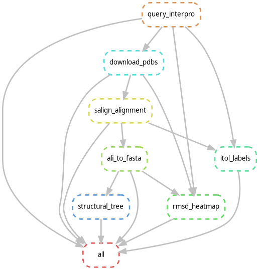

# DPS Structural Pipeline

**Automated and reproducible workflow for retrieving Dps protein structures, performing structural alignment, constructing phylogenetic trees, and visualizing structural divergence via RMSD heatmaps.**

Built with Snakemake and executed inside Docker/Apptainer containers — no manual steps, fully portable.

---

1. [Overview](#overview)
2. [Features](#features)
3. [Installation](#installation)
4. [MODELLER Setup](#modeller-setup)
5. [Configuration](#configuration)
6. [Pipeline Steps](#pipeline-steps)
7. [Output Structure](#output-structure)
8. [DAG](#dag)
9. [Reproducibility](#reproducibility)
10. [Troubleshooting](#troubleshooting)
11. [References](#references)
12. [Contact](#contact)

---

## Overview

The DPS Structural Pipeline provides a **reproducible and automated workflow for structural phylogenetics of Dps proteins across all species in the PDB**. It queries InterPro and EBI databases, selects the best structure per species (with paralog-aware detection), aligns them in 3D using MODELLER's SALIGN algorithm, builds a phylogenetic tree, generates an RMSD heatmap to visualize structural divergence, and produces a ready-to-use iTOL label file with species names.

Three distinct analyses are combined:

- **Structural alignment** — SALIGN optimizes residue correspondences using 3D atomic coordinates, more robust than sequence-only methods for divergent proteins
- **RMSD heatmap** — pairwise Cα RMSD matrix across all structures, visualizing structural distance at a glance
- **iTOL annotation** — species names are mapped to each PDB ID and written to a label file ready to upload to [iTOL](https://itol.embl.de/)

> !! Most steps run inside containers. The structural alignment step runs **locally** because MODELLER requires a license key.

---

## Features

- **InterPro-driven querying** — retrieves all Dps family structures using HMM-validated family membership (IPR002177, IPR014490), not keyword search — biologically rigorous
- **SIFTS supplement** — cross-references UniProt accessions against the EBI SIFTS flat file to catch structures that InterPro's structure endpoint missed; SIFTS cache is automatically refreshed every 30 days
- **Paralog-aware selection** — groups structures by UniProt accession per species; species with multiple distinct DPS proteins (e.g. *Deinococcus radiodurans* DrDps1/DrDps2, *Lactococcus lactis* DpsA/DpsB) keep one representative per paralog
- **Contamination filter** — validates every structure's UniProt accession against the InterPro-derived DPS family set, removing any mis-annotated non-DPS entries
- **Organism resolution** — unknown organisms are resolved from PDB file headers after download, avoiding any reliance on RCSB API calls
- **Manual include support** — structures not captured by InterPro/SIFTS can be added via `config.yaml` with a documented reason; metadata fetched automatically from PDBe/RCSB
- **`pdb_force` support** — for a given UniProt accession, always use a specific PDB ID regardless of resolution ranking; auto-fetches the forced structure if not already in the pool
- **Selection report** — full audit trail in `data/selection_report.tsv` listing every selected structure with PDB ID, organism, resolution, UniProt accession, source, and paralog flag
- **3D structural alignment** — SALIGN algorithm via MODELLER
- **Phylogenetic tree** — maximum-likelihood inference with IQ-TREE (ModelFinder + UFBoot, `.treefile` output)
- **RMSD heatmap** — pairwise Cα RMSD matrix visualized with seaborn, axes labelled with species names
- **iTOL label file** — automatically maps PDB IDs to species names for publication-ready tree visualization
- **Containerized** — all steps except SALIGN run in identical Docker/Apptainer environments
- **Config-driven** — swap InterPro IDs to analyze any protein family with zero code changes

---

## Installation

**Requirements:** Snakemake, Apptainer, and MODELLER (local)

```bash
# 1. Install Snakemake
conda install -c conda-forge -c bioconda snakemake

# 2. Install Apptainer (Ubuntu)
# Download apptainer_1.4.5_amd64.deb from https://github.com/apptainer/apptainer/releases/tag/v1.4.5
sudo apt install ./apptainer_1.4.5_amd64.deb

# 3. Clone the repo
git clone https://github.com/filipaifernandes/dps_structural_pipeline.git
cd dps_structural_pipeline

# 4. Run (with modeller environment active — see below)
conda activate modeller
snakemake --use-singularity --cores 4
```

The container image (`docker://filipafernandes/dps_structural_pipeline:014`) is pulled automatically on first run.

---

## MODELLER Setup

MODELLER must be installed **locally** (not in the container) because it requires a personal license key.

```bash
# 1. Register and get a free academic license at https://salilab.org/modeller/registration.html

# 2. Create a dedicated environment
conda create -n modeller python=3.10
conda activate modeller
pip install modeller

# 3. Activate your license key (follow MODELLER's documentation)

# 4. Verify
python -c "from modeller import *; print('MODELLER ready!')"
```

Always activate this environment before running the pipeline:

```bash
conda activate modeller
snakemake --use-singularity --cores 4
```

---

## Configuration

All pipeline behaviour is controlled via `config.yaml`:

```yaml
threads: 4

query:
  interpro_ids:
    - IPR002177   # DPS family — DNA-binding protein from starved cells
    - IPR014490   # DPS-like family — archaeal/alternative DPS

  manual_include:
    - pdb_id: 1zuj
      reason: "Lactococcus lactis DpsA — genuine DPS paralog not captured by InterPro/SIFTS retrieval"
    - pdb_id: 1zs3
      reason: "Lactococcus lactis DpsB — genuine DPS paralog not captured by InterPro/SIFTS retrieval"

  pdb_force:
    - uniprot: P0ABT2
      pdb_id: 1dps
      reason: "Escherichia coli DPS — canonical reference, preferred over higher-resolution alternatives"
    - uniprot: A0QXB7
      pdb_id: 2z90
      reason: "Mycolicibacterium smegmatis Dps — preferred over 5H46 (2.40 Å vs 2.85 Å)"

  uniprot_blacklist:
    - accession: P0DTC2
      reason: "SARS-CoV-2 spike protein — InterPro annotation error"

  pdb_blacklist:
    - pdb_id: 8fa2
      reason: "Mis-annotated non-DPS structure"
    - pdb_id: 3ak9
      reason: "Lower-resolution duplicate of 3ak8 — lacks UniProt annotation so pdb_force cannot handle it"
    - pdb_id: 8ouc
      reason: "Duplicate of 1dps (Escherichia coli) — kept as safety net"
    - pdb_id: 5h46
      reason: "Mycolicibacterium smegmatis (A0QXB7) — SIFTS re-adds after pdb_force, 2Z90 retained"

sifts_max_age_days: 30
```

| Parameter | Description |
|---|---|
| `threads` | CPU cores to use |
| `interpro_ids` | InterPro family accessions to query — drives all structure retrieval |
| `manual_include` | Structures to force-include regardless of InterPro annotation, with mandatory reason; metadata fetched automatically from PDBe/RCSB |
| `pdb_force` | For a given UniProt accession, always use a specific PDB ID — removes all other structures for that UniProt and auto-fetches the forced one if needed |
| `uniprot_blacklist` | UniProt accessions to exclude entirely (e.g. annotation errors) |
| `pdb_blacklist` | Specific PDB IDs to exclude (e.g. mis-annotated structures, SIFTS re-additions) |
| `sifts_max_age_days` | How many days to cache the SIFTS flat file before re-downloading (default: 30) |

### Repurposing for another protein family

To analyze a different protein family, replace the InterPro IDs:

```yaml
query:
  interpro_ids:
    - IPR001133   # ferritin
```

Zero code changes needed.

---

## Pipeline Steps

| Step | Rule | Tool | Execution | Output |
|---|---|---|---|---|
| Structure retrieval | `query_interpro` | InterPro API + SIFTS + PDBe + RCSB | Container | `data/pdb_ids.txt`, `data/species_map.json`, `data/selection_report.tsv` |
| Structure download | `download_pdbs` | Biopython PDBList | Container | `data/raw/*.pdb` |
| Structural alignment | `salign_alignment` | MODELLER SALIGN | **Local** | `data/alignment/structural.ali` |
| Format conversion | `ali_to_fasta` | custom script | Container | `data/alignment/structural.fasta` |
| Phylogenetic tree | `structural_tree` | IQ-TREE | Container | `data/tree/tree.treefile` |
| RMSD heatmap | `rmsd_heatmap` | Biopython + seaborn | Container | `data/heatmap/` |
| iTOL labels | `itol_labels` | custom script | Container | `data/itol/labels.txt` |

### Structure Retrieval Strategy

Structure retrieval is the most scientifically critical step. It uses a three-source approach plus two curation mechanisms:

**Source 1 — InterPro structure endpoint**
Queries `/api/structure/pdb/entry/interpro/{IPR_ID}/` for each configured InterPro ID. Returns PDB entries whose sequences have been matched to the family HMM profile — the most biologically rigorous definition of family membership.

**Source 2 — SIFTS flat file**
Downloads `pdb_chain_uniprot.csv.gz` from EBI FTP (cached locally, refreshed every `sifts_max_age_days` days). Cross-references the UniProt accessions collected in Source 1 against every PDB chain in SIFTS — catches structures that InterPro's structure endpoint missed. Also patches missing UniProt accessions for structures whose organism couldn't be resolved.

**Source 3 — Manual include**
Structures explicitly listed in `config.yaml` under `manual_include`. Used for historically unannotated but scientifically validated structures (e.g. `1zuj`, `1zs3` — *Lactococcus lactis* DpsA/DpsB). Each entry requires a documented reason. Metadata is fetched automatically from PDBe, with automatic fallback to RCSB for older entries not covered by PDBe.

**`pdb_force`**
After all sources are merged, `pdb_force` entries are applied: for a given UniProt accession, all other PDB IDs are removed and the specified structure is kept. If the forced PDB is not already in the pool, it is fetched automatically from PDBe/RCSB. This is used when a specific structure is preferred for scientific reasons (canonical reference, original publication structure) over whatever the automatic pipeline selects by resolution.

**Contamination filter**
Before SIFTS processing, a snapshot of the InterPro-derived UniProt set is taken. After all sources are merged, any structure whose UniProt accession is not in this snapshot is removed. This prevents mis-annotated non-DPS entries from entering the analysis (e.g. a SARS-CoV-2 spike protein entry erroneously annotated in InterPro as a DPS family member).

### Paralog-Aware Selection

Most species have one DPS protein — the pipeline keeps its best-resolution structure. Some species have genuine DPS paralogs with distinct UniProt accessions:

- *Deinococcus radiodurans* — DrDps1 (`Q9RS64`) + DrDps2 (`Q9RZN1`)
- *Pseudomonas aeruginosa* — canonical DPS (`Q9I4Z7`) + DPS-like (`Q9HUT3`)
- *Lactococcus lactis* — DpsA (`1zuj`) + DpsB (`1zs3`)
- *Mycolicibacterium smegmatis* — three paralogs with distinct UniProt accessions

Structures with the same UniProt accession (same protein, different crystal forms) always collapse to the best resolution, or to the `pdb_force` entry if specified.

### Reference Structure for Alignment

The structural alignment uses **1DPS** (*Escherichia coli* Dps, the original structure of the family) as the reference anchor. If 1DPS is not available in the selected set, the pipeline falls back to the first PDB ID in alphabetical order with a warning.

### iTOL Label Generation

The `itol_labels` rule reads `data/alignment/structural.ali`, extracts each PDB ID, and maps it to a species name using `data/species_map.json`. The result is an iTOL-compatible label file:

```
LABELS
SEPARATOR TAB
DATA
1dps_A    Escherichia coli
2c2f_A    Deinococcus radiodurans
...
```

To visualize:
1. Go to [iTOL](https://itol.embl.de/) and upload `data/tree/tree.treefile`
2. Drag and drop `data/itol/labels.txt` onto the tree
3. Export as SVG or PDF

---

## Output Structure

```
data/
├── pdb_ids.txt                  # Selected PDB IDs (one per paralog per species)
├── species_map.json             # PDB ID -> species name mapping
├── selection_report.tsv         # Full audit trail of structure selection
├── pdb_chain_uniprot.csv.gz     # Cached SIFTS flat file (auto-refreshed)
├── raw/
│   └── *.pdb                    # Downloaded structure files
├── alignment/
│   ├── structural.ali           # Structural alignment (PIR format)
│   └── structural.fasta         # Alignment in FASTA format
├── tree/
│   └── tree.treefile            # Phylogenetic tree (IQ-TREE Newick + bootstrap support)
├── heatmap/
│   ├── rmsd_matrix.csv          # Pairwise Cα RMSD matrix
│   └── rmsd_heatmap.png         # Heatmap visualization (axes labelled with species names)
└── itol/
    └── labels.txt               # iTOL annotation file with species names
```

### Selection Report (`selection_report.tsv`)

Full audit trail of every structure selected, with columns:

| Column | Description |
|---|---|
| `pdb_id` | PDB accession (uppercase) |
| `organism` | Source organism (binomial) |
| `resolution_A` | Crystal resolution in Ångströms |
| `uniprot` | UniProt accession |
| `source` | Where it was found: `IPR002177`, `IPR014490`, `sifts`, `manual`, or `pdb_force` |
| `is_paralog` | `yes` if the species has multiple DPS paralogs retained |

---

## DAG



Generate your own:
```bash
snakemake --dag | dot -Tpng > dag.png
```

---

## Reproducibility

- Snakemake tracks all file dependencies — only reruns steps whose inputs changed
- Docker/Apptainer containers pin all tool versions for every containerized step
- `config.yaml` is the single source of truth for all scientific decisions — InterPro IDs, manual inclusions, forced structures, blacklists, SIFTS refresh frequency
- `selection_report.tsv` provides a complete audit trail of every structure in the analysis, including source and paralog status
- All curation decisions (manual inclusions, forced structures, blacklisted entries) are documented with reasons directly in `config.yaml` — no silent curation

---

## Troubleshooting

**`ModuleNotFoundError: No module named 'modeller'`**
→ Activate the modeller environment: `conda activate modeller`

**`Apptainer not found`**
→ Verify with `apptainer --version` and reinstall if needed (see Installation)

**Folder path with spaces or special characters causes Singularity error**
→ Move the pipeline to a path without parentheses or spaces, e.g. `~/dps_pipeline/`

**Empty `pdb_ids.txt`**
→ Check InterPro is reachable: `curl https://www.ebi.ac.uk/interpro/api/entry/interpro/IPR002177/`
→ Verify InterPro IDs in `config.yaml` are valid

**SIFTS download fails**
→ Check EBI FTP is reachable: `curl -I https://ftp.ebi.ac.uk/pub/databases/msd/sifts/flatfiles/csv/pdb_chain_uniprot.csv.gz`
→ Delete `data/pdb_chain_uniprot.csv.gz` and rerun to force fresh download

**Structures missing from expected set**
→ Check `data/selection_report.tsv` — the `source` column shows where each structure came from
→ If a known DPS structure is absent, add it to `manual_include` in `config.yaml` with a reason
→ If you want a specific structure for a given UniProt, use `pdb_force`

**Unwanted structures appearing despite blacklist**
→ SIFTS may be re-adding them after `pdb_force` runs — add the offending PDB ID to `pdb_blacklist` as a safety net

**A `manual_include` entry is silently missing**
→ PDBe may not have a record for that entry (common for older structures)
→ The pipeline automatically falls back to RCSB — check the log for `Trying RCSB for ...`
→ If both fail, download the PDB file manually to `data/raw/` and add the entry to `data/pdb_ids.txt` and `data/species_map.json`

**Some structures silently missing from alignment**
→ Check `data/failed_pdb_ids.txt` after the download step — any PDB IDs that failed to download are logged there
→ The pipeline continues without them; if critical entries are missing, add them to `manual_include` or rerun with better connectivity

**IQ-TREE refuses to run — checkpoint found**
→ A previous run left a checkpoint file; IQ-TREE won't overwrite it by default
→ The pipeline passes `--redo` automatically — if you're running IQ-TREE manually, add `--redo`

**Alignment fails with structural errors**
→ Inspect `data/raw/` to verify PDB files are valid: `head -5 data/raw/*.pdb`
→ Very distant structures may require manual review

**`labels.txt` has PDB IDs instead of species names**
→ The organism could not be resolved from any source
→ Check `data/species_map.json` for that PDB ID
→ The PDB file header parser in `download_pdbs.py` should have resolved it — check the download log

For verbose Snakemake output: `snakemake --use-singularity --cores 4 -v`

---

## References

- **Snakemake** — Köster & Rahmann, *Bioinformatics* 2012
- **MODELLER / SALIGN** — Šali & Blundell, *J Mol Biol* 1993; Madhusudhan et al., *Bioinformatics* 2006
- **IQ-TREE** — Minh et al., *Mol Biol Evol* 2020; Kalyaanamoorthy et al., *Nat Methods* 2017 (ModelFinder); Hoang et al., *Mol Biol Evol* 2018 (UFBoot)
- **Biopython** — Cock et al., *Bioinformatics* 2009
- **InterPro** — Paysan-Lafosse et al., *Nucleic Acids Res* 2023
- **SIFTS** — Dana et al., *Nucleic Acids Res* 2019
- **PDBe** — Armstrong et al., *Nucleic Acids Res* 2020
- **RCSB PDB** — Burley et al., *Nucleic Acids Res* 2021

---

## Contact

**Filipa Fernandes** — Bioinformatics Student
📧 [filipaifernandes.2005@gmail.com](mailto:filipaifernandes.2005@gmail.com)
